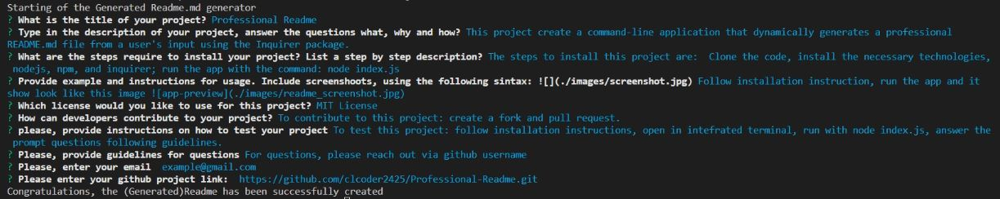

# Professional Readme
  
  ## Description:
  This project creates a readme generator that produce a Readme from user's input.

  ## Table of Contents:
  - [Installation Instructions](#Installation-Instructions)
  - [Usage](#Usage-Instructions)
  - [License](#License)
  - [Author](#Author)
  - [Github](#github-link)

  ## Installation Instructions:
  The steps to install this projects are: 1. Clone the code. 2. Install the necessary technologies  such as nodejs, npm, and inquirer. 3. Run the app with command: node index.js

  ## Usage Instructions:
  

  ## Author: 
  Carmen

  ## Github link:
  https://github.com/clcoder2425/Professional-Readme.git

  ## License:
  This project is licensed under the MIT License license. 
  
  - [License](#license)
